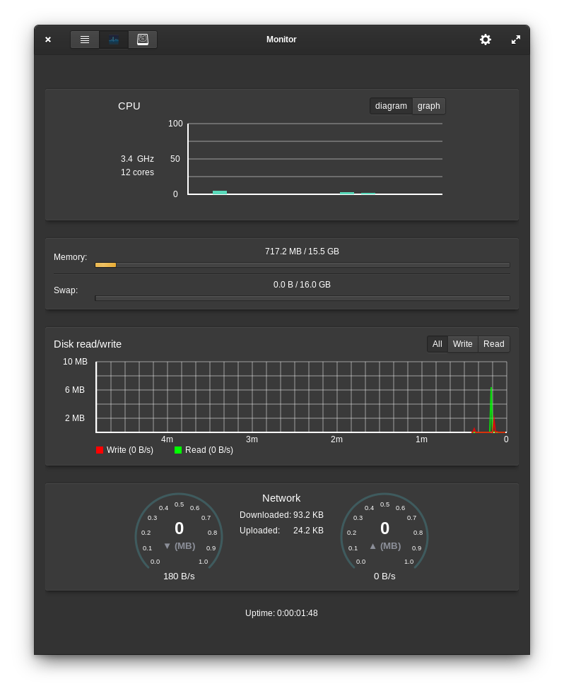

# Pantheon-monitor
Manage processes and monitor system resources.

----

### Indicator

### Resource monitoring

### Prefrences

---

## Building and Installation

You'll need the following dependencies to build:
* valac
* libgtk-3-dev
* libgranite-dev
* libbamf3-dev
* libwnck-3-dev
* libgtop2-dev
* libcairo2-dev
* libwingpanel-2.0-dev
* meson

## How To Build

    meson build --prefix /usr --buildtype=plain
    ninja -C build
    sudo ninja -C build install

I just connected:
https://github.com/stsdc/monitor
and
https://github.com/kmal-kenneth/monilet

From themselves added indicator.
It would be good to add icons to the indicator instead of a caption.
