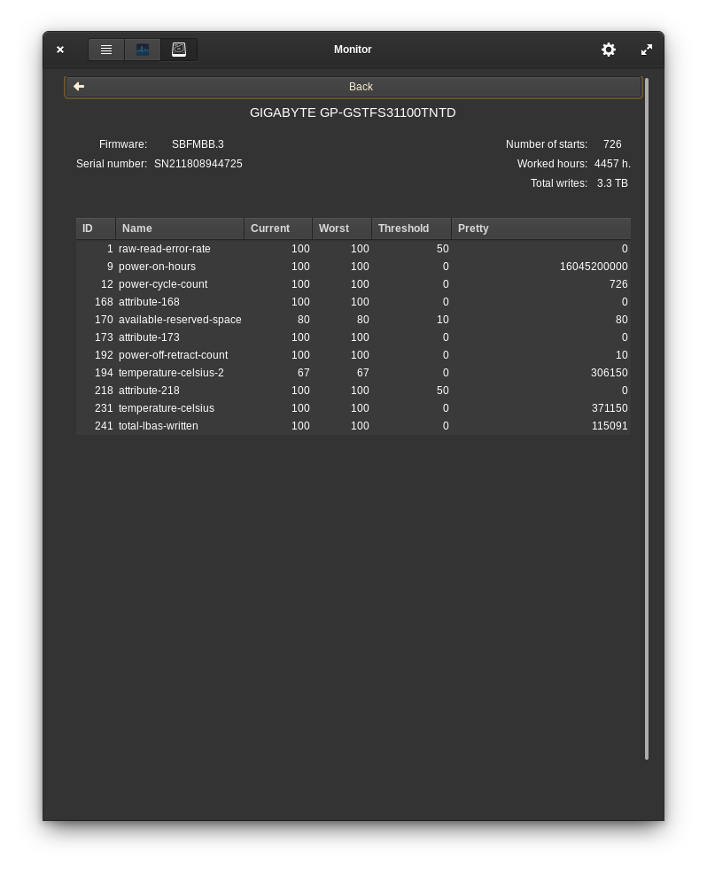

# Pantheon-monitor
Manage processes, monitor of system resources and drives.

----

### Indicator

### Resource monitor

### Disks monitor

---

Special thanks Alexey Varfolomeev (@varlesh) who designed icons.

## Building and Installation

You'll need the following dependencies to build:
* valac
* libgtk-3-dev
* libgranite-dev
* libbamf3-dev
* libwnck-3-dev
* libgee-0.8-dev
* libgtop2-dev
* libcairo2-dev
* libwingpanel-2.0-dev
* libudisks2-dev
* meson

## How To Build

    meson build --prefix=/usr
    ninja -C build
    sudo ninja -C build install
